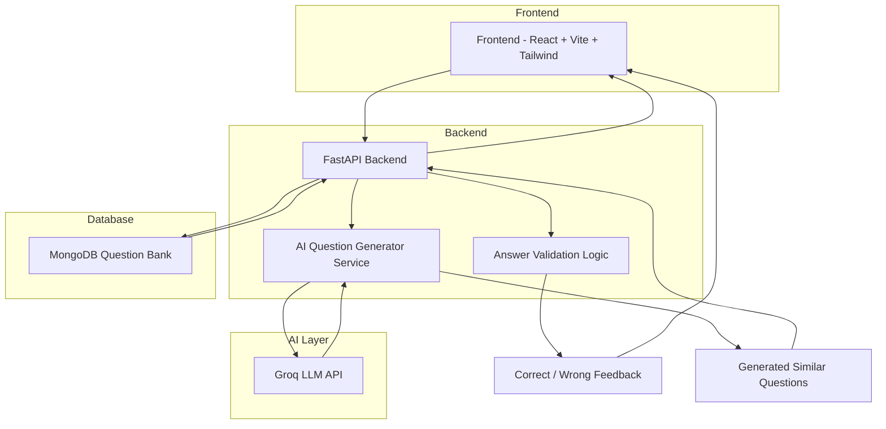

## 📐 Project Architecture Diagram

```mermaid
graph TB
    A[Frontend - React + Vite + Tailwind] --> B[FastAPI Backend]

    B --> C[MongoDB Question Bank]
    C --> B

    B --> D[Answer Validation Logic]
    D --> E[Correct / Wrong Feedback]
    E --> A

    B --> F[AI Question Generator Service]
    F --> G[Groq LLM API]
    G --> F

    F --> H[Generated Similar Questions]
    H --> B
    B --> A

    subgraph Frontend
        A
    end

    subgraph Backend
        B
        D
        F
    end

    subgraph Database
        C
    end

    subgraph AI Layer
        G
    end
```
