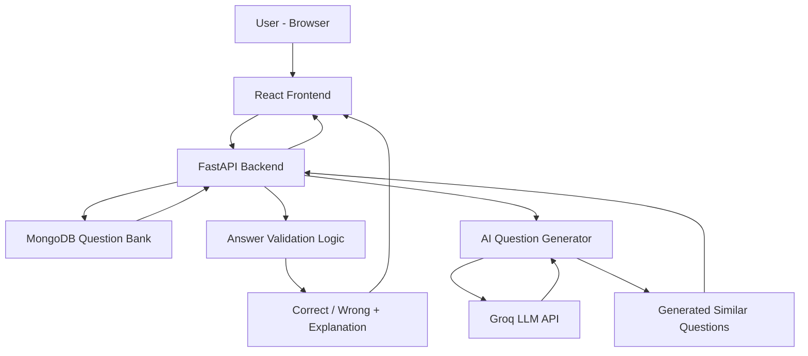

# 📌 Introduction

Math AI Question Generator is a production-structured, full‑stack web application for practicing math problems with instant evaluation, step‑by‑step explanations, and AI‑generated similar questions. It is designed for correctness, clarity, and scalability.

This repository includes a React + Vite frontend, a FastAPI backend, a MongoDB question bank, and an AI generation service that uses the Groq LLM API.

---

## 📋 Table of Contents

- [📌 Introduction](#-introduction)  
- [🌟 Features](#-features)  
- [🏗️ Architecture](#-architecture)  
- [🔧 Technologies Used](#-technologies-used)  
- [📋 Prerequisites](#-prerequisites)  
- [🚀 Installation](#-installation)  
- [⚙️ Configuration](#-configuration)  
- [📖 Usage](#-usage)  
- [🎯 API Endpoints](#-api-endpoints)  
- [🖥️ Frontend UI Overview](#-frontend-ui-overview)  
- [📁 Project Structure](#-project-structure)  
- [🧪 Testing](#-testing)  
- [🐛 Troubleshooting](#-troubleshooting)  
- [🤝 Contributing](#-contributing)  
- [📄 License](#-license)

---

## 🌟 Features

- Intelligent question practice driven from a centralized question bank.
- Multiple choice questions (A, B, C, D) with immediate correctness feedback.
- Step‑by‑step explanations shown after answer selection.
- AI-generated similar questions that preserve concept and difficulty while changing numerical values.
- Clean, responsive UI with skeleton loading states and clear answer locking semantics.
- Production-aligned layout and configuration for deployability.

---

## 🏗️ Architecture

The high-level architecture diagram:



---

## 🔧 Technologies Used

- Frontend
  - [React](https://react.dev/)
  - [Vite](https://vitejs.dev/)
  - [Tailwind CSS](https://tailwindcss.com/)
  - [Node.js](https://nodejs.org/)
  - [JavaScript (ES6+)](https://developer.mozilla.org/en-US/docs/Web/JavaScript)

- Backend
  - [FastAPI](https://fastapi.tiangolo.com/)
  - [Python](https://www.python.org/)
  - [Pydantic](https://pydantic-docs.helpmanual.io/)
  - [Uvicorn](https://www.uvicorn.org/)

- Database
  - [MongoDB](https://www.mongodb.com/)

- AI
  - [Groq](https://groq.com/) (Groq LLM API)
  - YAML-based prompt management and output validation

- Testing
  - [Pytest](https://pytest.org/)

---

## 📋 Prerequisites

- Node.js 18+ ([download](https://nodejs.org/))
- Python 3.9+ ([download](https://www.python.org/))
- MongoDB (local or Atlas) ([docs](https://www.mongodb.com/))
- Internet access for external API (Groq)

Supported OS: macOS, Linux, Windows 10/11.

---

## 🚀 Installation

1. Clone the repository:

```bash
git clone https://github.com/Omprakash6353/math-ai-question-generator.git
cd math-ai-question-generator
```

2. Backend setup:

```bash
cd backend
python -m venv venv
# Activate the virtual environment:
# macOS / Linux
source venv/bin/activate
# Windows (PowerShell)
venv\Scripts\Activate.ps1
# Install dependencies
pip install -r requirements.txt
```

3. Frontend setup:

```bash
cd ..
npm install
```

---

## ⚙️ Configuration

Create a `.env` file inside `backend/` (do not commit secrets):

```
GROQ_API_KEY=your_groq_api_key_here
MONGO_URI=mongodb://localhost:27017
```

- GROQ_API_KEY: API key for Groq LLM access.
- MONGO_URI: MongoDB connection string (use Atlas or local instance).

Follow best practices: use secret managers for production and restrict API key scopes.

---

## 📖 Usage

Start the backend (development):

```bash
cd backend
source venv/bin/activate   # macOS/Linux
uvicorn app.main:app --reload --host 0.0.0.0 --port 8000
```

- Backend: http://localhost:8000  
- Swagger UI (OpenAPI): http://localhost:8000/docs

Start the frontend:

```bash
npm run dev
```

- Frontend (Vite): http://localhost:5173

---

## 🎯 API Endpoints

Standard endpoints provided by the backend:

- GET /questions — List questions (pagination as applicable)
- GET /question/{id} — Retrieve a single question by id
- POST /generate — Generate AI-similar questions

Request/response sample for answer evaluation:

```json
{
  "question": "string",
  "options": { "A": "...", "B": "...", "C": "...", "D": "..." },
  "correct": "A",
  "userAnswer": "B"
}
```

For AI generation, POST /generate accepts an existing question payload and returns two validated, similar questions with:
- question text
- options
- correct option
- explanation
- difficulty tag

Authentication, rate limiting, and input validation should be added before production use.

---

## 🖥️ Frontend UI Overview

- Card-based question view with:
  - Question text
  - Options A–D
  - Answer selection and visual locking
  - Step-by-step explanation panel
  - Buttons to generate and practice AI-generated questions
- Responsive layout (mobile-first)
- Skeleton loaders while fetching data
- Accessibility: keyboard navigation, semantic HTML, ARIA where applicable

---

## 📁 Project Structure

Updated project structure (root: Math_Om). Use this as the canonical reference for the repository layout — adjust filenames and locations if your local repository differs.

Math_Om/
├── backend/  
│   ├── app/  
│   │   ├── main.py               # FastAPI application entrypoint  
│   │   ├── routes.py             # API route definitions  
│   │   ├── db.py                 # Database connection utilities  
│   │   ├── ai.py                 # Top-level AI integration (request handlers)  
│   │   │  
│   │   ├── services/  
│   │   │   └── ai_services.py    # Groq integration & prompt handling  
│   │   │  
│   │   ├── config/  
│   │   │   ├── prompts.yaml  
│   │   │   └── ai_config.yaml  
│   │   │  
│   │   └── __init__.py  
│   │  
│   ├── tests/  
│   │   └── test_solve_math.py  
│   │  
│   ├── requirements.txt  
│   ├── .env.example  
│   └── conftest.py  
│  
├── src/   (Frontend)  
│   ├── App.jsx  
│   ├── main.jsx  
│   │  
│   ├── components/  
│   │   ├── QuestionSelector.jsx  
│   │   ├── QuestionCard.jsx  
│   │   ├── SelectedQuestionCard.jsx  
│   │   ├── GenerateButton.jsx  
│   │   ├── GeneratedQuestions.jsx  
│   │   └── SkeletonQuestion.jsx  
│   │  
│   ├── lib/  
│   │   └── api.js  
│   │  
│   ├── utils/  
│   │   └── questionGenerator.js  
│   │  
│   └── index.css  
│  
├── public/  
│  
├── package.json  
├── vite.config.js  
├── tailwind.config.js  
└── README.md

Notes and guidance:
- The backend exposes the API from `backend/app/main.py`. Keep `ai.py` for request-level AI handlers and `services/ai_services.py` for the integration, prompt assembly, and validation logic.
- Tests and test fixtures live under `backend/tests/` and `backend/conftest.py`.
- The frontend is located in `src/` and is a standard Vite + React layout. `lib/api.js` centralizes API calls; `utils/questionGenerator.js` contains client-side generation helpers and input normalization.
- Keep environment files and secrets out of version control; commit `.env.example` only.

---

## 🧪 Testing

Backend tests (pytest):

```bash
cd backend
source venv/bin/activate
pytest
```

- Aim for unit tests for validation, answer-checking logic, and AI output validation.
- Integration tests should cover API contracts and basic end-to-end flows.

---

## 🐛 Troubleshooting

- Backend not starting:
  - Verify virtual environment is active and Python version >= 3.9.
  - Check installed packages in requirements.txt.

- AI generation failing:
  - Confirm GROQ_API_KEY is set and has required access.
  - Inspect request/response logs for rate limits or schema issues.

- Frontend shows blank page:
  - Ensure backend is running and CORS is configured if the frontend consumes the API.
  - Check browser console for JS errors and Vite terminal for build errors.

---

## 🤝 Contributing

Contributions are welcome. Follow these steps:

1. Fork the repository.
2. Create a feature branch: `git checkout -b feat/my-feature`
3. Write tests and documentation for your change.
4. Open a pull request with a clear description and linked issue (if applicable).

Guidelines:
- Keep commits small and focused.
- Write descriptive commit messages.
- Ensure linters and tests pass before submitting.

---

## 📄 License

This project is released under the MIT License. See the LICENSE file for details.

---

